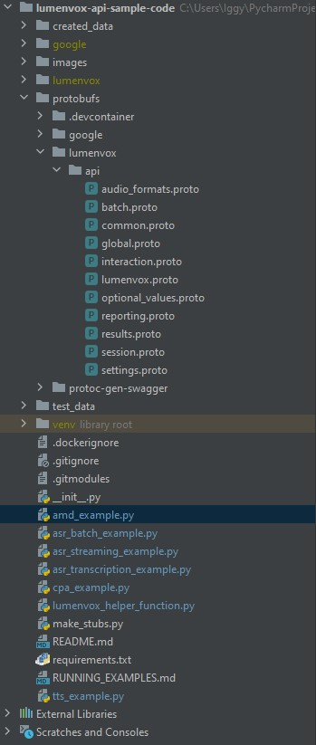
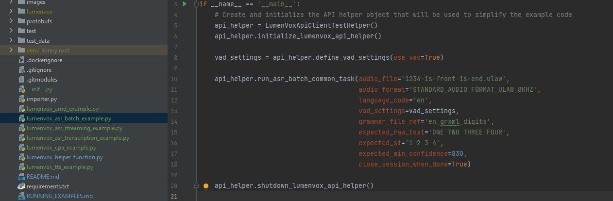

# LumenVox Speech API

## Python sample code results

The following screenshots and information are related to the python sample code
that is publicly available in GitHub:

This is a sample project that demonstrates how to communicate with the LumenVox
 API over gRPC using the published `lumenvox.proto` definition file.

This sample code is written using Python, which was selected for its simplicity
to clearly show interactions with the API.

gRPC supports many programming languages the choice should be driven by your
business needs, not these simplistic examples.

Creating and using a virtual environment for a Python project helps a lot and
allows to use the project dependencies file a bit easier.

For the examples included, PyCharm Community Edition was used to view and run
the tests, but other IDEs can be used to run the sample code.  PyCharm is an 
Integrated Development Environment, that allows viewing, editing, compiling and 
debugging programs.

## Python Project Structure (PyCharm)



We can see the Python Project tree structure using PyCharm, we can see the
`protobufs` folder that contains the `lumenvox.proto` file that defines all available
calls and procedures available in the lumenvox API, then the Test Data including
the python scripts for each of the tests we will be running, asr, transcription,
cpa & amd, tts.

At the bottom, we see the virtual environment enabled for this project including
the different scripts for the examples to be tested. In the top section on the
left side, we see multiple files in
the `/lumenvox/api/` directory below your project root. These files
are:

* lumenvox_pb2.py
* lumenvox_pb2_grpc.py
* audio_format_pb2.py
* common_pb2.py
* global_pb2.py
* interaction_pb2.py
* optional_values_pb2.py
* reporting_pb2.py
* reporting_pb2_grpc.py
* results_pb2.py
* session_pb2.py
* settings_pb2.py

These were automatically generated via the make_stubs.py script included in the
venv folder, based on the `lumenvox.proto` file, this is the actual process of
compiling the `lumenvox.proto` file to be used in a Python environment, a similar
process must be followed with other programming languages as required.

Additionally, the test_data folder now includes the different grammar and
audio files used in our examples.

Now our python applications can talk to the LumenVox API using gRPC.
And we can test using our IDE

## Code Samples

These tables show the different samples that are available and their
corresponding data required for the examples to run successfully.
There are 4 examples for ASR, and a simple TTS example, as you can see below:

Sample code provided for testing ASR capabilities:

| ASR script                                 | grammar         | audio(ulaw 8khz)                   | results                                       |
|--------------------------------------------|-----------------|------------------------------------|-----------------------------------------------|
| asr\_batch\_example.py                     | en\_digits.grxml | 1234-1s-front-1s-end.ulaw          | transcript and confidence score for each word |
| asr\_streaming\_example.py                 | en\_digits.grxml | 1234.alaw                          | transcript and confidence score for each word |
| asr\_transcription\_example.py             |                 | the\_great\_gatsby\_1\_minute.ulaw | transcript and confidence score for each word |
| asr\_transcription\_phraselist\_example.py |  | english\_wordlist.wav              | transcript and confidence score for each word |
| cpa\_example.py                            |                 | human\_residence.ulaw              | result: BEEP                                  |
| amd\_example.py                            |                 | audio-TBD-AM.ulaw                  | result: HUMAN RESIDENCE                       |


Sample code provided for testing TTS capabilities:

| TTS script      | ssml       | voice   | results                                         |
|-----------------|------------|---------|-------------------------------------------------|
| tts\_example.py | ssml\_text | Lindsey | synthesis results, words, sentences, Voice used |

## Running Python scripts

The provided samples folder can be opened as a project in an IDE like PyCharm
and then run from within it, assuming that Python is installed and operational
in the system.



If you are not using an IDE, you can run via terminal (i.e. SSH or PowerShell)
using python as shown here:
```shell
python.exe python_sample_name.py
```

or specifying the installation path for python if it is not defined in your
path:
```shell
"C:\path\to\python\python.exe" "C:/path/to/python_sample_code/asr_batch_example.py"
```

## asr_batch_example.py

The `en_digits.grxml` is used along with the audio file `1234.alaw`, both in the
test_data directory within the structure of our project, in this example.
Note that we use standard audio, ulaw at 8khz, and the language is
English.

> Note: this is just a view of the asr_batch script, behind scenes you may
> notice that there are some references to the lumenvox_api, which is used for all
> included examples to simplify the amount of coding needed to run and
> understand how to interact with the API.
> 
> The lumenvox_api is the file that handles gRPC requests in the tests we are
> running.

```python
    lumenvox_api.run_user_coroutine(
        asr_batch_interaction(lumenvox_api=lumenvox_api,
                              audio_file='../test_data/Audio/en/1234-1s-front-1s-end.ulaw',
                              audio_format=audio_formats.AudioFormat.StandardAudioFormat.STANDARD_AUDIO_FORMAT_ULAW,
                              sample_rate_hertz=8000,
                              language_code='en',
                              grammar_file_ref='../test_data/Grammar/en-US/en_digits.grxml',
                              ), )
```

This is the grammar file used for the `asr_batch_example.py` sample, a simple English
`digits` grammar:

```xml
<?xml version='1.0'?>
<grammar version='1.0'
	tag-format='semantics/1.0.2006'
	mode='voice' xml:lang='en-US'
	root='root'
	xmlns:xsi='http://www.w3.org/2001/XMLSchema-instance'
	xsi:schemaLocation='http://www.w3.org/TR/speech-grammar/grammar.xsd'
	xmlns='http://www.w3.org/2001/06/grammar'>

	<rule id='digit'>
		<one-of>
			<item>ZERO<tag>out="0";</tag></item>
			<item>ONE<tag>out="1";</tag></item>
			<item>TWO<tag>out="2";</tag></item>
			<item>THREE<tag>out="3";</tag></item>
			<item>FOUR<tag>out="4";</tag></item>
			<item>FIVE<tag>out="5";</tag></item>
			<item>SIX<tag>out="6";</tag></item>
			<item>SEVEN<tag>out="7";</tag></item>
			<item>EIGHT<tag>out="8";</tag></item>
			<item>NONE<tag>out="9";</tag></item>
		</one-of>
	</rule>

	<rule id='root'>
	    <tag>var digits="";</tag>
		<item repeat="1-10">
			<ruleref uri='#digit'/>
			<tag>digits+=rules.latest(); digits += " ";</tag>
		</item>
	    <tag>out=digits;</tag>
	</rule>

</grammar>
```

## asr_batch_example.py results:

These are the results presented after successfully running the `lumenvox_asr_batch_example.py` 
sample:

```shell
session_create: Writing session request to stream.
session_id from session_create: 39ab7ba0-4976-48f8-ad86-2a8d11062502
interaction_id extracted from interaction_create_asr response is: ceecaa33-a94f-483e-b5ad-6c81f670b989
>> task_read_session_streams: final_result
 correlation_id {
  value: "f1d931fc-ca00-4373-8ae6-7980cd40d39d"
}
final_result {
  interaction_id: "ceecaa33-a94f-483e-b5ad-6c81f670b989"
  final_result {
    asr_interaction_result {
      n_bests {
        asr_result_meta_data {
          words {
            start_time_ms: 719
            duration_ms: 500
            word: "one"
            confidence: 898
          }
          words {
            start_time_ms: 1459
            duration_ms: 500
            word: "two"
            confidence: 882
          }
          words {
            start_time_ms: 2259
            duration_ms: 599
            word: "three"
            confidence: 845
          }
          words {
            start_time_ms: 3159
            duration_ms: 560
            word: "four"
            confidence: 999
          }
          transcript: "one two three four"
          start_time_ms: 719
          duration_ms: 3000
          confidence: 922
        }
        semantic_interpretations {
          interpretation {
            fields {
              key: "interpretation"
              value {
                string_value: "\"1 2 3 4 \""
              }
            }
          }
          interpretation_json: "\"1 2 3 4 \""
          grammar_label: "file:///usr/bin/Buffer_Grammar"
          confidence: 905
          tag_format: "semantics/1.0.2006"
        }
      }
      input_mode: "voice"
      language: "en"
    }
  }
}

session_close: Writing session request to stream.
```

## asr_streaming_example.py

This is a partial view of the `asr_streaming_example.py` sample code, just to notice 
how this sample code is using the `digits.grxml` grammar file and the same
`1234.alaw` audio file we used before:

```python
    lumenvox_api.run_user_coroutine(
        asr_streaming_session(lumenvox_api,
                              language_code='en',
                              grammar_file_ref='../test_data/Grammar/en-US/en_digits.grxml',
                              audio_ref='../test_data/Audio/en/1234.alaw',
                              audio_format=audio_formats.AudioFormat.StandardAudioFormat.STANDARD_AUDIO_FORMAT_ALAW,
                              chunk_size=4000,
                              ), )
```

## asr_streaming_example.py results

In the results presented here we can see messages related to different audio
chunks that are being streamed, along with the partial results:

```shell
session_create: Writing session request to stream.
session_id from session_create: c231f75e-860e-41db-99a7-83f32f2cbc96
interaction_id extracted from interaction_create_asr 2afe44af-06c1-4562-82a8-bc51772d6cbb
sending audio chunk  1  more bytes =  True
sending audio chunk  2  more bytes =  True
sending audio chunk  3  more bytes =  True
sending audio chunk  4  more bytes =  True
sending audio chunk  5  more bytes =  True
sending audio chunk  6  more bytes =  True
sending audio chunk  7  more bytes =  True
sending audio chunk  8  more bytes =  True
sending audio chunk  9  more bytes =  True
sending audio chunk  10  more bytes =  True
sending audio chunk  11  more bytes =  True
sending audio chunk  12  more bytes =  True
sending audio chunk  13  more bytes =  True
sending audio chunk  14  more bytes =  True
sending audio chunk  15  more bytes =  True
sending audio chunk  16  more bytes =  True
sending audio chunk  17  more bytes =  True
sending audio chunk  18  more bytes =  True
sending audio chunk  19  more bytes =  True
>> task_read_session_streams: final_result
 correlation_id {
  value: "0bf36520-e483-483f-97ba-3b2d1bea06e4"
}
final_result {
  interaction_id: "2afe44af-06c1-4562-82a8-bc51772d6cbb"
  final_result {
    asr_interaction_result {
      n_bests {
        asr_result_meta_data {
          words {
            start_time_ms: 699
            duration_ms: 500
            word: "one"
            confidence: 968
          }
          words {
            start_time_ms: 1439
            duration_ms: 500
            word: "two"
            confidence: 847
          }
          words {
            start_time_ms: 2240
            duration_ms: 599
            word: "three"
            confidence: 740
          }
          words {
            start_time_ms: 3139
            duration_ms: 560
            word: "four"
            confidence: 847
          }
          transcript: "one two three four"
          start_time_ms: 699
          duration_ms: 3000
          confidence: 865
        }
        semantic_interpretations {
          interpretation {
            fields {
              key: "interpretation"
              value {
                string_value: "\"1 2 3 4 \""
              }
            }
          }
          interpretation_json: "\"1 2 3 4 \""
          grammar_label: "file:///usr/bin/Buffer_Grammar"
          confidence: 845
          tag_format: "semantics/1.0.2006"
        }
      }
      input_mode: "voice"
      language: "en"
    }
  }
}

session_close: Writing session request to stream.
audio streaming thread shutting down
```

## asr_transcription_example.py

This example is also set for audio streaming mode, the main difference here is
the grammar file that is used to define the transcription mode to be enabled.
Note that some sample audio used for the transcription example is courtesy of
the [Open Speech Repository](https://www.voiptroubleshooter.com/open_speech/index.html)

Please visit their website for details and conditions of use:

```python
# Audio sample courtesy of Open Speech Repository: https://www.voiptroubleshooter.com/open_speech/index.html

    lumenvox_api.run_user_coroutine(
        asr_transcription_session(lumenvox_api, language_code='en',
                                  audio_ref='../test_data/Audio/en/transcription/the_great_gatsby_1_minute.ulaw',
                                  chunk_size=4000,
                                  ), )
```

## asr_transcription_example.py results

These are the results returned by the script, with the different audio chunks,
partial results, and final results with overall and individual confidence
scores:

```shell
D:\AzureGit\Cloud\CloudSpeechTest\lumenvox-api-sample-code\venv\Scripts\python.exe D:\AzureGit\Cloud\CloudSpeechTest\lumenvox-api-sample-code\asr_transcription_example.py 
session_create: Writing session request to stream.
session_id from session_create: 07cb0aaf-07fd-4762-9030-edfd81caa3b8
interaction_id extracted from interaction_create_transcription 82fb0a29-c637-44e7-abb8-7aad98c96a2e
sending audio chunk  1  more bytes =  True
sending audio chunk  2  more bytes =  True
sending audio chunk  3  more bytes =  True
sending audio chunk  4  more bytes =  True
sending audio chunk  5  more bytes =  True
sending audio chunk  6  more bytes =  True
sending audio chunk  7  more bytes =  True
sending audio chunk  8  more bytes =  True
sending audio chunk  9  more bytes =  True
sending audio chunk  10  more bytes =  True
sending audio chunk  11  more bytes =  True
sending audio chunk  12  more bytes =  True
sending audio chunk  13  more bytes =  True
sending audio chunk  14  more bytes =  True
sending audio chunk  15  more bytes =  True
sending audio chunk  16  more bytes =  True
sending audio chunk  17  more bytes =  True
sending audio chunk  18  more bytes =  True
sending audio chunk  19  more bytes =  True
sending audio chunk  20  more bytes =  True
sending audio chunk  21  more bytes =  True
sending audio chunk  22  more bytes =  True
sending audio chunk  23  more bytes =  True
sending audio chunk  24  more bytes =  True
sending audio chunk  25  more bytes =  True
sending audio chunk  26  more bytes =  True
sending audio chunk  27  more bytes =  True
sending audio chunk  28  more bytes =  True
sending audio chunk  29  more bytes =  True
sending audio chunk  30  more bytes =  True
sending audio chunk  31  more bytes =  True
sending audio chunk  32  more bytes =  True
sending audio chunk  33  more bytes =  True
sending audio chunk  34  more bytes =  True
sending audio chunk  35  more bytes =  True
sending audio chunk  36  more bytes =  True
sending audio chunk  37  more bytes =  True
sending audio chunk  38  more bytes =  True
sending audio chunk  39  more bytes =  True
sending audio chunk  40  more bytes =  True
sending audio chunk  41  more bytes =  True
sending audio chunk  42  more bytes =  True
sending audio chunk  43  more bytes =  True
sending audio chunk  44  more bytes =  True
sending audio chunk  45  more bytes =  True
sending audio chunk  46  more bytes =  True
>> task_read_session_streams: final_result
 correlation_id {
  value: "be93962c-6a7f-482a-9af5-fb7375bd5229"
}
final_result {
  interaction_id: "82fb0a29-c637-44e7-abb8-7aad98c96a2e"
  final_result {
    transcription_interaction_result {
      n_bests {
        asr_result_meta_data {
          words {
            start_time_ms: 540
            duration_ms: 459
            word: "recorded"
            confidence: 938
          }
          words {
            start_time_ms: 1019
            duration_ms: 280
            word: "books"
            confidence: 890
          }
          words {
            start_time_ms: 1399
            duration_ms: 740
            word: "present"
            confidence: 895
          }
          words {
            start_time_ms: 2579
            duration_ms: 99
            word: "an"
            confidence: 820
          }
          words {
            start_time_ms: 2739
            duration_ms: 560
            word: "unabridged"
            confidence: 870
          }
          words {
            start_time_ms: 3339
            duration_ms: 579
            word: "recording"
            confidence: 907
          }
          words {
            start_time_ms: 3999
            duration_ms: 439
            word: "of"
            confidence: 902
          }
          words {
            start_time_ms: 4760
            duration_ms: 99
            word: "the"
            confidence: 811
          }
          words {
            start_time_ms: 4920
            duration_ms: 259
            word: "great"
            confidence: 933
          }
          words {
            start_time_ms: 5260
            duration_ms: 879
            word: "gatsby"
            confidence: 795
          }
          words {
            start_time_ms: 6619
            duration_ms: 159
            word: "by"
            confidence: 999
          }
          words {
            start_time_ms: 6900
            duration_ms: 399
            word: "scott"
            confidence: 682
          }
          words {
            start_time_ms: 7320
            duration_ms: 1000
            word: "fitzgerald"
            confidence: 644
          }
          words {
            start_time_ms: 9579
            duration_ms: 459
            word: "narrated"
            confidence: 862
          }
          words {
            start_time_ms: 10060
            duration_ms: 119
            word: "by"
            confidence: 959
          }
          words {
            start_time_ms: 10300
            duration_ms: 299
            word: "frank"
            confidence: 999
          }
          words {
            start_time_ms: 10640
            duration_ms: 659
            word: "miller"
            confidence: 753
          }
          words {
            start_time_ms: 13640
            duration_ms: 419
            word: "chapter"
            confidence: 989
          }
          words {
            start_time_ms: 14180
            duration_ms: 500
            word: "one"
            confidence: 999
          }
          words {
            start_time_ms: 15960
            duration_ms: 119
            word: "in"
            confidence: 999
          }
          words {
            start_time_ms: 16119
            duration_ms: 159
            word: "my"
            confidence: 999
          }
          words {
            start_time_ms: 16359
            duration_ms: 519
            word: "younger"
            confidence: 840
          }
          words {
            start_time_ms: 16919
            duration_ms: 119
            word: "and"
            confidence: 722
          }
          words {
            start_time_ms: 17079
            duration_ms: 259
            word: "more"
            confidence: 724
          }
          words {
            start_time_ms: 17379
            duration_ms: 579
            word: "vulnerable"
            confidence: 938
          }
          words {
            start_time_ms: 18019
            duration_ms: 359
            word: "yours"
            confidence: 852
          }
          words {
            start_time_ms: 18479
            duration_ms: 159
            word: "my"
            confidence: 947
          }
          words {
            start_time_ms: 18759
            duration_ms: 299
            word: "father"
            confidence: 999
          }
          words {
            start_time_ms: 19139
            duration_ms: 179
            word: "gave"
            confidence: 999
          }
          words {
            start_time_ms: 19339
            duration_ms: 99
            word: "me"
            confidence: 999
          }
          words {
            start_time_ms: 19479
            duration_ms: 140
            word: "some"
            confidence: 999
          }
          words {
            start_time_ms: 19659
            duration_ms: 419
            word: "advice"
            confidence: 999
          }
          words {
            start_time_ms: 20099
            duration_ms: 119
            word: "that"
            confidence: 935
          }
          words {
            start_time_ms: 20259
            duration_ms: 119
            word: "i\'ve"
            confidence: 790
          }
          words {
            start_time_ms: 20399
            duration_ms: 140
            word: "been"
            confidence: 741
          }
          words {
            start_time_ms: 20559
            duration_ms: 119
            word: "here"
            confidence: 502
          }
          transcript: "recorded books present an unabridged recording of the great gatsby by scott fitzgerald narrated by frank miller chapter one in my younger and more vulnerable yours my father gave me some advice that i\'ve been here"
          start_time_ms: 540
          duration_ms: 20139
          confidence: 853
        }
      }
    }
  }
}

session_close: Writing session request to stream.
audio streaming thread shutting down
```

## amd_example.py & cpa_example.py

```python
 # Should return "Human Residence" classification
    lumenvox_api.run_user_coroutine(
        cpa_session(lumenvox_api,
                    audio_ref='../test_data/Audio/cpa/human_residence.ulaw',
                    audio_format=audio_formats.AudioFormat.StandardAudioFormat.STANDARD_AUDIO_FORMAT_ULAW,
                    chunk_size=2000,
                    ), )

# Should return "BEEP" classification
    lumenvox_api.run_user_coroutine(
        amd_session(lumenvox_api,
                    audio_ref='../test_data/Audio/amd/audio-TDB-AM.ulaw',
                    audio_format=audio_formats.AudioFormat.StandardAudioFormat.STANDARD_AUDIO_FORMAT_ULAW,
                    chunk_size=2000,
                    ), )
```


```
## tts_example.py

The TTS example is pretty straightforward, the text to be synthesized is defined
via SSML and the voice, audio format, and language are shown below.
The option to `tts_output_file_name` is the name of a file to output tts to.  In this case to the root directory where 
the python scripts are.

```python
    lumenvox_api.run_user_coroutine(
        tts_interaction(lumenvox_api,
                        language_code='en-us', voice='Chris',
                        audio_format=audio_formats.AudioFormat.StandardAudioFormat.STANDARD_AUDIO_FORMAT_ULAW,
                        sample_rate_hertz=8000,
                        text="Hello World",
                        tts_output_file_name="tts_test.ulaw"
                        ), )
```

## tts_example.py results

The audio synthesis results for the `tts_example.py` sample are shown below, in
this case showing there were 5 words successfully synthesized, 1 sentence, and
the voice used was `Chris`

```shell
session_create: Writing session request to stream.
session_id from session_create: cb087bbc-80b1-4a60-b90b-34808aa3d5ec
interaction_id extracted from interaction_create_tts response is: 246f7eae-d684-4d3d-b308-bf6e64060138
>> task_read_session_streams: final_result
 correlation_id {
  value: "7066aec9-d973-4de1-986b-509c9b7e4145"
}
final_result {
  interaction_id: "246f7eae-d684-4d3d-b308-bf6e64060138"
  final_result {
    tts_interaction_result {
      audio_format {
        standard_audio_format: STANDARD_AUDIO_FORMAT_ULAW
        sample_rate_hertz {
          value: 8000
        }
      }
      audio_length_ms: 1271
      sentence_offsets_ms: 0
      word_offsets_ms: 46
      word_offsets_ms: 462
      voice_offsets {
        name: "Chris"
      }
    }
  }
}

session_close: Writing session request to stream.
```
